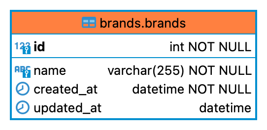

# GQL Brands - Sportissimo

1) Run `docker-compose up`

2) Load data-fixtures `docker-compose exec php php bin/console doctrine:fixtures:load --no-interaction`

3) Open http://localhost:8081

4) Open http://localhost:8081/graphiql and check gql api

Execute Queries:
```json
{brands(itemsPerPage: 3, page: 1) {
	items {
		id,name}
	currentPage,totalCount,perPage}}
```
```
mutation {createBrand(name:"xx"){id,name}}
```
```
mutation{updateBrand(name:"yy", id:101){id,name}}
```
```
mutation{deleteBrand(id:44)}
```

### Database ###

